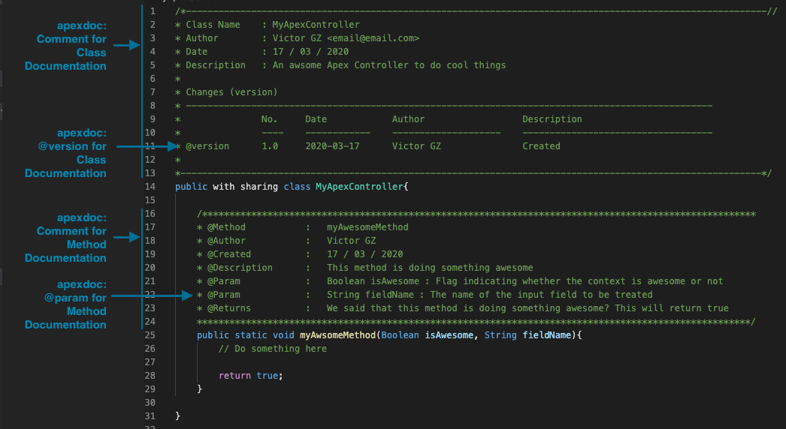

# Snippets for Salesforce Developers

A suit of VSCode Snippets that will help Salesforce Developers to boost their productivity!

The [Salesforce Extension Pack](https://marketplace.visualstudio.com/items?itemName=salesforce.salesforcedx-vscode) has already some code snippets to be used in Apex, Javascript and even... specific for LWC! However, **this collection of Snippets focuses on covering other aspects of a developer's daily tasks (probably less funny), like commenting your code and creating your components documentation!** So, what's included?

- Fast access to defined comment structures for your Apex classes and methods
- All the items you might need to create your auradoc files
- Navigate easily through the values to be modified in the snippet by just pressing the Tab key of your keyboard
- Some information will be automatically included: the name of your class name, the current date...

## Installation

The VSCode extension is available in the [VisualStudio Marketplace](https://marketplace.visualstudio.com/items?itemName=victorgz.snippets-for-salesforce-devs) to be directly installated. Thanks to this, you will automatically receive the new updates and features included in the extension.

Alternatively, you can download this repository, package the extension and install it locally.

## How to use
  
1. Insert your snippets by using the "Insert Snippet" command in VSCode (Ctrl/Cmd + shift + P) or using the snippet shortcuts directly from you workspace! You can find list of all the available shortcuts in the next section.

2. Fill the specific fields with the information that is relevant to your project/method/class... Depending on the snippet, you will see that one or more variables will be highlighted. Just write the value you want, press the Tab key of your keyboard and it will automatically focus into the next one!

## List of available snippets
### APEX
Pre-built comments to document your Apex classes and methods.
|Trigger| Description |
|--|--|
|`!!apexdoc method`|Add a comment block for your Apex method
|`!!apexdoc @param for method comment`|Add a new @param line for the previously created comment block of your Apex method
|`!!apexdoc class`|Add a comment block for your Apex class
|`!!apexdoc @version for class comment`|Add a new @version line for the previously created comment block of your Apex class

  

### AURA
All the available auradoc items that you need to document your Aura Components.
|Trigger | Description |
|--|--|
|`!!auradoc: Basic Structure`|Create the basic structure for the auradoc file
|`!!auradoc: Title`|Insert a title in your auradoc description
|`!!auradoc: Paragraph`|Insert a paragraph in your auradoc description
|`!!auradoc: Inline Code`|Insert an inline block of code in your auradoc description
|`!!auradoc: Link`|Insert a link to a URL in your auradoc description
|`!!auradoc: Code Block`|Insert a full code of block inside your auradoc description
|`!!auradoc: Bulleted List`| Insert a bulleted list in your auradoc description
|`!!auradoc: Numbered List`| Insert a numbered list in your auradoc description
|`!!auradoc: Table`| Insert a table in your auradoc description
|`!!auradoc: aura:example`| Create a new example reference in your auradoc

## Contributing
Pull requests are welcome. For major changes, please [open an issue](https://github.com/victorgz/vscode-snippets-for-salesforce/issues) first to discuss what you would like to change.