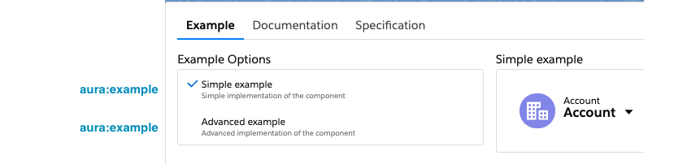

<h1 align="left">Snippets for Salesforce Developers</h1>

   
   
   
   

   <h2>A suit of VSCode Snippets that will help Salesforce Developers to boost their productivity!</h2>
   

   <h4>
      <a href="#overview">Overview</a> |
      <a href="#installation">Installation</a> |
      <a href="#how-it-works">How it Works</a> |
      <a href="#available-snippets">Available snippets</a> |
      <a href="#settings">Settings</a> |
      <a href="#contributing">Contributing</a>
   </h4>

## Overview

The [Salesforce Extension Pack](https://marketplace.visualstudio.com/items?itemName=salesforce.salesforcedx-vscode) has already some code snippets to be used in Apex, Javascript and even... specific for LWC! However, **this collection of Snippets focuses on covering other aspects of a developer's daily tasks (probably less funny), like commenting your code and creating your components documentation!** So, what's included?

- Fast access to defined comment structures for your Apex classes and methods
- All the items you might need to create your auradoc files
- Navigate easily through the values to be modified in the snippet by just pressing the Tab key of your keyboard
- Some information will be automatically included: the author information from your git configuration, the name of your class name, the current date... and more !

## Installation

The VSCode extension is available in the [VisualStudio Marketplace](https://marketplace.visualstudio.com/items?itemName=victorgz.snippets-for-salesforce-devs) to be directly installated. Thanks to this, you will automatically receive the new updates and features included in the extension.

Alternatively, you can download this repository, package the extension and install the VSIX file locally.

## How it works

1. Configure the prefix that will trigger your snippets. Go to Settings > Extensions > Snippets for Salesforce Developers and modify the Prefix value. By default the '!!' combination is set, but you can use whatever combination of characteres you want... time to be creative! Some examples are: ##, doc, !doc... Your snippest are ready to use!

2. While you are coding, just tap the prefix you defined in the previous step to trigger the available options. You will then see a list of snippets that are available for the current language-context
   

2. Fill the specific fields with the information that is relevant to your project/method/class... Depending on the snippet, you will see that one or more variables will be highlighted. Just write the value you want, press the Tab key of your keyboard and it will automatically focus into the next one!
   

## Available snippets

### APEX

Pre-built comment blocks and tags to document your Apex classes and methods based on the [Javadoc](https://www.oracle.com/technetwork/java/javase/documentation/index-137868.html) format.

| Snippet                                | Description                                                                         |
| -------------------------------------- | ----------------------------------------------------------------------------------- |
| `doc class comment`                    | Add a new block comment for your class. The comment includes basic information about your class explained with different tags. By default, it will include the name, author, created, description and a changelog with version tags. Other additional tags can be included inside this comment.
| `doc method comment`                   | Add a new block comment for your method. The comment includes basic information about your method explained with different tags. By default, it will include the name, author, created, description, param and return tags. Other additional tags can be included inside this comment |
| `doc @name`                            | Add a new @name tag for your class and method comments. It represents the name of your class or method |
| `doc @author`                          | Add a new @author tag for your class and method comments. This includes the name and the email of the author. By default, these values will be filled automatically if there is an existing git cofiguration for the current project. |
| `doc @created`                         | Add a new @created tag for your class and method comments. This indicate the date when the code was originally created. By default, the date will be filled automatically to today. |
| `doc @description`                     | Add a new @description tag for your class and method comments. You can provide an explanation of what your code does |
| `doc @version`                         | Add a new @version tag for your class comments. This refers is used to generate a change log, in which every contribution specifies the version, the date, the author and a description of the changes done. |
| `doc @param`                           | Add a new @param tag for your method comments. Multiple @param lines can be included, and each of them will include its object type and name |
| `doc @return`                          | Add a new @return tag for your method comments. This option describes what is returned in your method. Omit this tag for methods that returns void. |
| `doc @exception`                       | Add a new @exception tag for your method comments. This contains the type and a description of the exception that can potentially be thrown from your method. |
| `doc @deprecated`                      | Add a new @deprecated tag for your class and method coments. You can provide a description of why this code has been deprecated, in which API version and whether it has been replaced by another functionality |

### AURA

All the available auradoc items that you need to document your Aura Components. You can find more information in the [Salesforce Developer Documentation](https://developer.salesforce.com/docs/atlas.en-us.lightning.meta/lightning/docs_intro.htm)

| Trigger                  | Description                                                 |
| ------------------------ | ----------------------------------------------------------- |
| `doc auradoc structure`  | Create the basic structure for the auradoc file             |
| `doc title`              | Insert a title in your auradoc description                  |
| `doc paragraph`          | Insert a paragraph in your auradoc description              |
| `doc inline code`        | Insert an inline block of code in your auradoc description  |
| `doc link`               | Insert a link to a URL in your auradoc description          |
| `doc code block`         | Insert a full code of block inside your auradoc description |
| `doc bulleted list`      | Insert a bulleted list in your auradoc description          |
| `doc numbered list`      | Insert a numbered list in your auradoc description          |
| `doc table`              | Insert a table in your auradoc description                  |
| `doc aura:example`       | Create a new example reference in your auradoc              |

## Settings

The extension includes some settings so you can adapt it to better fit your needs

| Option                                     | Default | Description                                       |
| ------------------------------------------ | ------- | ------------------------------------------------- |
| Prefix                                     | `!!`    | The shortcut used to trigger the suggestions (e.g. !!, ##, zz, abc...). Please note that some combinations of characteres might not work and that VSCode would have to be reloaded in order to have this setting applied             |
| Apex: Length of Class Comment Separator    | `long`  | Determines if the comment for a class will have long or short separators at the top and at the bottom |
| Apex: Lenght Of Method Comment Separator   | `long`  | Determines if the comment for a method will have long or short separators at the top and at the bottom |

## Contributing

Pull requests are welcome. For major changes, please [open an issue](https://github.com/victorgz/vscode-snippets-for-salesforce/issues) first to discuss what you would like to change.

## Dependencies

- [simple-git 1.132.0](https://github.com/steveukx/git-js)